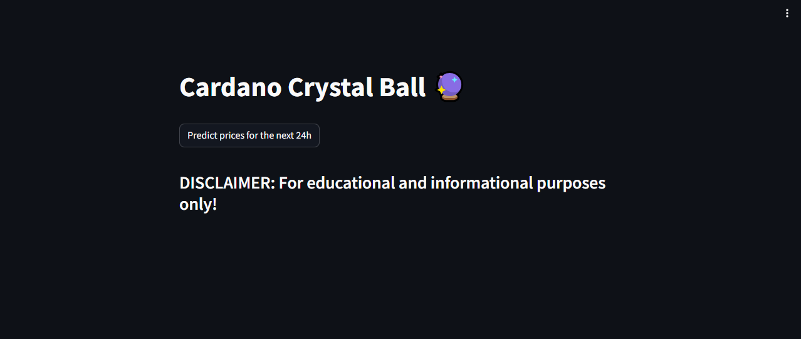
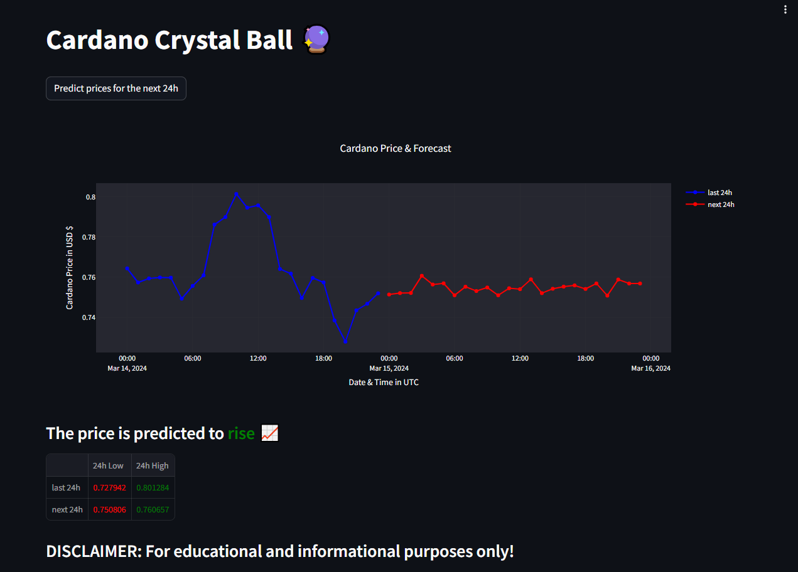

# Cardano Crystal Ball Website

Welcome to the repository for the Cardano Crystal Ball website! This website provides insights, predictions to Cardano (ADA) using cutting-edge analytics and deep learning techniques( Only for educational and informational purposes).

## About

The Cardano Crystal Ball website aims to offer:
- Real-time price predictions
- Interactive charts and graphs

## Features

### Real-time Price Predictions
Our deep learning models analyze historical data to provide real-time price predictions for Cardano.

### Interactive Charts and Graphs
Visualize Cardano's performance over time with our interactive charts and graphs.

## Installation

To run this website locally:
1. Clone this repository for website: https://github.com/Shahab89/cardano-crystal-ball-website.git
2. Clone this repository for source codes: https://github.com/Shahab89/cardano_crystal_ball.git

